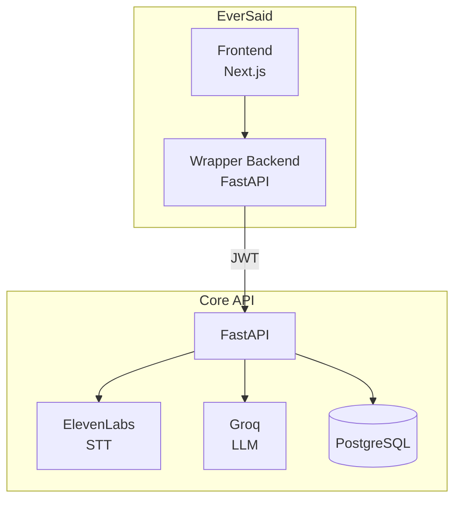

# EverSaid

**Smart audio transcription with LLM-powered cleanup for Slovenian and English.**

Try it free. No account required.

[Live App](https://eversaid.ai)

---

## Architecture



**Why a wrapper backend?**

The Core API handles user data with encryption, JWT auth, and audit trails. The wrapper backend adds:
- Anonymous sessions (try before signing up)
- Multi-tier rate limiting (fair usage without friction)
- Credential isolation (Core API keys stay server-side)

Anonymous visitors get auto-generated accounts in Core API — real accounts with real data, just without the signup form. Rate limits are enforced per-session, per-IP, and globally to balance generous access with abuse prevention.

For technical deep-dives, see [Architecture](docs/ARCHITECTURE.md).

---

## Features

- 🎙️ Transcription via ElevenLabs with word-level timestamps
- 👥 Speaker diarization (color-coded by speaker)
- ✨ LLM cleanup (removes filler words, corrects grammar, preserves meaning)
- 📊 AI analysis profiles (summary, action items, reflection)
- 🌍 Slovenian / English UI (including proper Slovenian plural forms)
- 🔒 No account required

---

## Stack

| | |
|-|-|
| **Frontend** | Next.js 16, TypeScript, Tailwind v4, shadcn/ui, react-virtuoso, Recharts |
| **Backend** | FastAPI, httpx, SQLite (sessions) |
| **Testing** | Vitest, Playwright E2E, Storybook |
| **Infra** | Docker Compose |

---

## Running Locally

```bash
cp .env.example .env
# Add CORE_API_URL and credentials
docker compose up
# → http://localhost:3000
```

> ⚠️ Core API access coming soon. Join the [waitlist](https://eversaid.ai) to get notified.

---

## Screenshots

TODO
