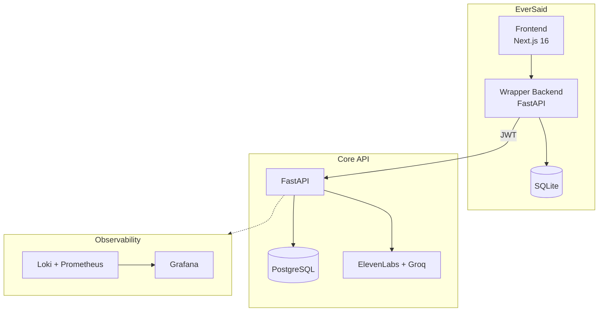

# Architecture

Technical deep-dive into EverSaid's design decisions.

---

## System Overview



**Why two backends?**

The Core API is infrastructure. The wrapper backend is the product.

- **Session management:** Anonymous users get cookies mapped to Core API JWTs. Credentials never touch the browser.
- **Rate limiting:** Product-specific limits (free tier, paid tiers). Core API doesn't know or care about pricing.
- **Product features:** Waitlist, feedback, payments, user accounts. None of this belongs in Core API.
- **Separation of concerns:** Core API can serve multiple products. Each product brings its own business logic.

---

## Key Design Decisions

### 1. Anonymous Sessions with Real Accounts

**Problem:** Users should try the product without signing up, but we need to track usage for rate limiting and associate data with users.

**Solution:** Anonymous visitors get auto-generated anonymous accounts in the Core API. They're real accounts with real data, just without the signup form.

```
Browser cookie (session_id)
    ↓
Wrapper backend maps to Core API JWT
    ↓
Core API sees a normal authenticated user
```

**Tradeoff:** More complexity than simple rate limiting by IP, but allows:
- Persistent history across sessions
- Consistent data model (no "anonymous" edge cases in Core API)

---

### 2. Multi-Tier Rate Limiting

**Problem:** Transcription and LLM calls cost money. Need to prevent abuse while being generous to legitimate users.

**Solution:** Three tiers, all enforced at the wrapper backend:

| Tier | Purpose                           |
|------|-----------------------------------|
| Per-session/day | Fair allocation per user          |
| Per-IP/day | Prevents session rotation abuse   |
| Global/day | Circuit breaker                   |

**Key detail:** Limits are committed *after* successful Core API calls. If transcription fails, the user isn't charged against their limit.

**Why not at Core API level?** Rate limits are product-specific. A different product using the same Core API might have different limits, pricing tiers, or no limits at all.

---

### 3. Words-First Data Architecture

**Problem:** Transcription data needs to support multiple views (full text, segments, speaker-grouped) without data duplication.

**Solution:** Store words as the atomic unit. Derive everything else.

```json
{
  "words": [
    {"id": 0, "text": "Hello", "start": 0.0, "end": 0.5, "speaker_id": 0},
    {"id": 1, "text": "world", "start": 0.6, "end": 1.0, "speaker_id": 0},
    {"id": 2, "text": "Hi", "start": 1.5, "end": 1.8, "speaker_id": 1}
  ]
}
```

**Derived views:**
- Full text: join all words
- Segments: group consecutive words by `speaker_id`
- Timeline: words already have timestamps

**Tradeoff:** Slightly more computation on read, but:
- Single source of truth
- No sync issues between "segments" and "words" representations

---

### 4. Envelope Encryption

**Problem:** User data must be encrypted at rest. Simple encryption with a single key means key rotation affects all data.

**Solution:** Three-layer envelope encryption:

```
Master Key (env var)
    ↓ derives
Key Encryption Key (per-user)
    ↓ encrypts
Data Encryption Key (per-entry)
    ↓ encrypts
Actual data (transcription, audio path, etc.)
```

**Benefits:**
- Key rotation only re-wraps KEKs, not all data
- Per-user KEK enables account deletion without touching other users
- Per-entry DEK limits blast radius of any single key compromise

---

### 5. Background Processing with Status Polling

**Problem:** Transcription and LLM cleanup take 5-30 seconds. Can't block HTTP requests that long.

**Solution:** Immediate response with status, client polls for completion.

```
POST /transcribe
  → 202 Accepted, entry_id: "abc123", status: "pending"

GET /entries/abc123
  → status: "processing" (poll again)
  → status: "completed", transcription_data: {...}
```

**Why not WebSockets?** Simpler infrastructure, works through all proxies/CDNs, client can close tab and come back.

**Why not webhooks?** Anonymous users have no callback URL. Polling is universal.

**Implementation:** FastAPI BackgroundTasks for fire-and-forget. Status tracked in DB (`pending` → `processing` → `completed`/`failed`).

---

## Data Flow: Transcription Request

```
1. User uploads audio (browser)
        ↓
2. Wrapper backend receives multipart form
   - Validates session cookie
   - Checks rate limits (fail fast)
        ↓
3. Wrapper forwards to Core API with JWT
        ↓
4. Core API:
   - Stores audio
   - Creates VoiceEntry (pending)
   - Queues background transcription
   - Returns entry_id immediately
        ↓
5. Background task:
   - Calls ElevenLabs API
   - Parses response to words-first format
   - Encrypts and stores transcription_data
   - Updates status to completed
        ↓
6. Client polls GET /entries/{id}
   - Wrapper proxies to Core API
   - Returns current status + data when ready
        ↓
7. On success, wrapper commits rate limit usage
```

---

## Observability

### Structured Logging

All services use JSON structured logs with consistent fields:

```json
{
  "timestamp": "2024-01-15T10:30:00Z",
  "level": "INFO",
  "component": "transcription",
  "user_id": "abc123",
  "entry_id": "def456",
  "duration_ms": 2340,
  "message": "Transcription completed"
}
```

**Key fields:**
- `component`: Which service/module (for filtering)
- `user_id`: For tracing user journeys (anonymized in logs)
- `duration_ms`: For performance tracking
- `entry_id`/`request_id`: For request tracing

### Metrics & Dashboards

Grafana dashboards track:
- Request latency (p50, p95, p99)
- Error rates by endpoint
- Rate limit hits by tier
- Background task queue depth
- External API latency (ElevenLabs, Groq)

---

## Future Considerations

Decisions made with future extensibility in mind:

- **Provider abstraction:** Transcription and LLM services use factory pattern. Adding providers requires implementing an interface, not modifying existing code.
- **Multi-tenant ready:** User isolation is enforced at query level, not application level. Adding organizations/teams is additive.
- **Webhook support:** Background task pattern can easily add webhook callbacks when users have accounts with callback URLs.

---

## Related Documentation

- [README](../README.md): Product overview and quick start
- Core API docs: *Coming soon*
